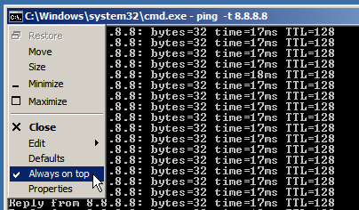

# AlwaysOnTopper
Simple app for Windows, adds 'Always on top' item to system menu of every window.

## How to use
Just run **AlwaysOnTopper.exe**. It has not any GUI. Every window should have "Always on top" in menu now. It's recommended to add this app to autorun.

## Author/contacts

**Alexey 'Cluster' Avdyukhin**

clusterrr@clusterrr.com

[https://github.com/ClusterM](https://github.com/ClusterM "https://github.com/ClusterM")

[http://clusterrr.com](http://clusterrr.com "http://clusterrr.com")

PayPal for donations: clusterrr@clusterrr.com
